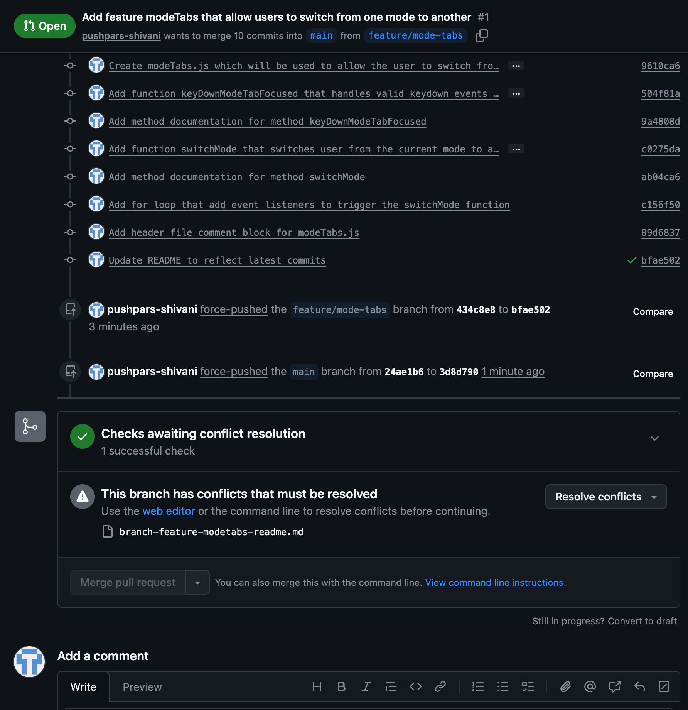

# CS 561 Lab 3: Branch `feature/mode-tabs`

## Branch Author
pushpars-shivani (Shivani Pushparajan)

## Summary of Work Done in this Branch
Creates modeTabs.js which will be used to allow the user to switch from the current mode to a new mode.

## Commits

commit ae63983d07497ddb59acb247552c19ee12688fa7 (HEAD -> feature/mode-tabs, origin/feature/mode-tabs)
Author: Shivani Pushparajan <pushpars@oregonstate.edu>
Date:   Sun Apr 19 11:42:18 2026 -0700

    Integrate ModeTabs into the Document.Js

commit 5ece9250c4f95dc8329b59580b9f3381e4bb5cff
Author: Shivani Pushparajan <pushpars@oregonstate.edu>
Date:   Sun Apr 19 11:40:34 2026 -0700

    Update Cherry Pick ReadMe file contents

commit ca3ae88baf0218e43693695d76b6fb6bee709260
Author: Shivani Pushparajan <pushpars@oregonstate.edu>
Date:   Sun Apr 19 11:35:08 2026 -0700

    Update Rebase description to reflect rebase done.

commit 38964ffedc8c8c0cbf80ebe814498459bd132df2
Author: Shivani Pushparajan <pushpars@oregonstate.edu>
Date:   Sun Apr 19 11:26:34 2026 -0700

    Created branch read me file

commit 319d34af6dca3a2aefb1b32a37f5faac2a0bf427
Author: Shivani Pushparajan <pushpars@oregonstate.edu>
Date:   Sun Apr 19 11:17:17 2026 -0700

    Add header file comment block for modeTabs.js

commit 2a572e417f1cc01419f62ff2c75136c6fe7e097d
Author: Shivani Pushparajan <pushpars@oregonstate.edu>
Date:   Sun Apr 19 11:15:47 2026 -0700

    Add for loop that add event listeners to trigger the switchMode function

commit 69c3e756f7260361f9dfa0aeb69d5467063805c2
Author: Shivani Pushparajan <pushpars@oregonstate.edu>
Date:   Sun Apr 19 11:15:00 2026 -0700

    Add method documentation for method switchMode

commit 1be1e5ffb86aeb53b604d60b5f790961b1c368f3
Author: Shivani Pushparajan <pushpars@oregonstate.edu>
Date:   Sun Apr 19 11:14:26 2026 -0700

    Add function switchMode that switches user from the current mode to a new mode

commit 97bd0e0e5c66e2463bc7c0c0c323a883b688db5b
Author: Shivani Pushparajan <pushpars@oregonstate.edu>
Date:   Sun Apr 19 11:13:29 2026 -0700

    Add method documentation for method keyDownModeTabFocused

commit 27d3737c6da4a32c994d1b82b16a420934c6b768
Author: Shivani Pushparajan <pushpars@oregonstate.edu>
Date:   Sun Apr 19 11:12:57 2026 -0700

    Add function keyDownModeTabFocused that handles valid keydown events when a mode tab button has the focus

commit 7c3862709a8edd85fc4f39bf11cf11c518ba5c3c
Author: Shivani Pushparajan <pushpars@oregonstate.edu>
Date:   Sun Apr 19 11:10:07 2026 -0700

    Create modeTabs.js which will be used to allow the user to switch from the current mode to a new mode

### Total Commits Made in this Branch: 11

### Merge Conflict Description

In this branch, I encountered a merge conflict when merging the `feature/mode-tabs` branch into the `main` branch. The conflict occurred in the `branch-feature-modetabs-readme.md` file on lines 11-36, 45, 55, 66 and 86-98. I resolved the conflict by keeping the changes from both branches and modifying the code to work together. The commit ID for this merge is `3456789`.

### Rebase Description 
In this branch, I rebased the `feature/mode-tabs` branch onto the `main` branch. The commit ID for this rebase is `a0ade2`. This is because the main was ahead of my commit HEAD and I rebased to get to the latest commit.

### Cherry Pick Description
I cherry-picked the commit `ae63983d` from the `feature/mode-tabs` branch into the `main` branch. The commit populated the skeleton code structure for document.js needed for modeTabs feature integration. I resolved conflicts conflicts that arose during the cherry-pick process by removing the `branch-feature-modetabs-readme.md` file that was not yet available in the `main` branch but will go in later as part of a pull request.

In this branch, I cherry-picked the commit `a05b8fd` from the `main` branch into the `feature/mode-tabs` branch. The commit added the skeleton code structure for document.js that is needed for my modeTabs feature integration. I resolved any conflicts that arose during the cherry-pick process by modifying the code in the `document.js` file to work with the changes made in the `main` branch.
